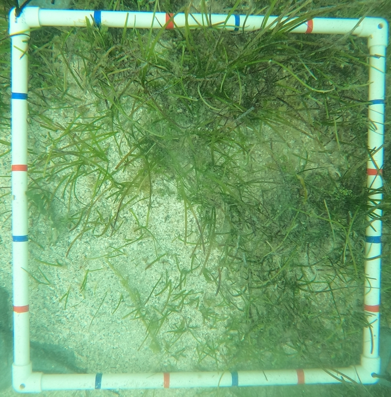

# IVCAP Service for applying PaddlePaddle models to Images

This directory implements [PaddleSeg](https://github.com/PaddlePaddle/PaddleSeg),
the development toolkit for image segmentation based
on [PaddlePaddle](https://github.com/paddlepaddle/paddle) as an IVCAP service.

This service can then requested to perform image segmentation for a specific image under
a specific model. Both, image and model need to be first uploaded to IVCAP to become
IVCAP `artifacts`.

As an example, the following image on the left is one taken of a seagrass quadrant, and
the one of the right is the result of the segmentation produced by a particular model:

<div>
  
  
</div>

## Usage: User Perspective

We assume that the service has already been deployed. To check that, we can use the `ivcap` cli tool.

```
% ivcap service list
+----+--------------------------+------------------------------------+
| ID | NAME                     | PROVIDER                           |
+----+--------------------------+------------------------------------+
| @1 | infer-with-paddle-paddle | urn:ivcap:provider:45a06508-...    |
....
```

To get more information on the service itself:

```
% ivcap service get @1

          ID  urn:ivcap:service:8773f79e-...                             
        Name  infer-with-paddle-paddle                                                            
 Description  A service which applies a PaddlePaddle model to a set of images                     
              ...                                                                             
  Parameters  ┌───────────────────┬────────────────────────────────┬──────────────────┬─────────┐ 
              │ NAME              │ DESCRIPTION                    │ TYPE             │ DEFAULT │ 
              ├───────────────────┼────────────────────────────────┼──────────────────┼─────────┤ 
              │             model │ Model to use (tgz archive of a │ artifact         │ ???     │ 
              │                   │ ll needed components)          │                  │         │ 
              ├───────────────────┼────────────────────────────────┼──────────────────┼─────────┤ 
              │             image │ Image to analyse               │ artifact         │ ???     │ 
              ├───────────────────┼────────────────────────────────┼──────────────────┼─────────┤ 
              │      max-img-size │ Reduce 'image' to this many pi │ int              │ 1000000 │ 
              │                   │ xels. If set to -1, leave unch │                  │         │ 
              │                   │ anged                          │                  │         │ 
              ├───────────────────┼────────────────────────────────┼──────────────────┼─────────┤ 
              ...
  ...
```

We would also assume that one or more models have already been uploaded:

```
% ivcap metadata search -s urn:ibenthos:schema:paddle.seg.model.1

  Schema  urn:ibenthos:schema:paddle.seg.model.1                                                                    
 Records  ┌────┬─────────────────────────────────┬────────────────────────────────────────┐ 
          │ ID │ ENTITY                          │ SCHEMA                                 │ 
          ├────┼─────────────────────────────────────────────────────────┼────────────────┤ 
          │ @1 │ urn:ivcap:artifact:8c5f6ca6-... │ urn:ibenthos:schema:paddle.seg.model.1 │ 
          │ @2 │ urn:ivcap:artifact:145fdbdd-... │ urn:ibenthos:schema:paddle.seg.model.1 │ 
          └────┴─────────────────────────────────────────────────────────┴────────────────┘ 
```

To find out more about the model and the _ArtifactID_ (`urn:ivcap:artifact:...`) to the model data itself:

```
% ivcap metadata get @1
{
  "aspect": {
    "$schema": "urn:ibenthos:schema:paddle.seg.model.1",
    "name": "ocrnet_hrnetw48_seagrass_test",
    "artifact": "urn:ivcap:artifact:8c5f6ca6-...",
    "model": {
      "backbone": {
        "pretrained": "https://bj.bcebos.com/paddleseg/dygraph/hrnet_w48_ssld.tar.gz",
        "type": "HRNet_W48"
      },
      "backbone_indices": [ 0 ],
      "num_classes": 2,
      "type": "OCRNet"
    },
    ...
  },
  ...
}
```

Finally, we need an image to process. Like the above model, images are also _artifacts_ in IVCAP and
can be 'created' with the `ivcap` cli tool.

```
% ivcap artifact create -f ./examples/GOPR0247.JPG 
Created artifact 'urn:ivcap:artifact:c0b3b4f7-...'
... uploading file 100% [==============================] (1.4 MB/s)         
Completed uploading 'urn:ivcap:artifact:c0b3b4f7-...'

         ID  urn:ivcap:artifact:c0b3b4f7-... 
     Status  ready                                                   
       Size  10 MB                                                   
  Mime-type  image/jpeg                                              
  ...  
```

We now have everything in place; _service-id_ (`urn:ivcap:service:8773f79e-...`),
model artifact (`urn:ivcap:artifact:8c5f6ca6-...`), and image artifact (`urn:ivcap:artifact:c0b3b4f7`).
To initiate processing, we need to create an order for the infer service (make sure you are using
the service and artifact IDs from your own context)

```
% ivcap order create -n "seagrass test #1" urn:ivcap:service:8773f79e-... \  
      model=urn:ivcap:artifact:8c5f6ca6-... \
      image=urn:ivcap:artifact:c0b3b4f7-...
Order 'urn:ivcap:order:88983e97-...' with status 'pending' submitted.
```

To check progress on this order:

```
% ivcap order get urn:ivcap:order:88983e97-...

         ID  urn:ivcap:order:88983e97-...                                  
       Name  seagrass test #1                                                                      
     Status  executing                                                                             
    Ordered  4 minutes ago (26 May 23 09:58 AEST)                                                  
    Service  infer-with-paddle-paddle (@5)         
    ...
```

Which should finally change to something like:

```
% ivcap order get urn:ivcap:order:88983e97-...
         ID  urn:ivcap:order:88983e97-...                                  
       Name  seagrass test #1                                                                      
     Status  succeeded                                                                             
    Ordered  12 minutes ago (26 May 23 09:58 AEST)                                                 
    Service  infer-with-paddle-paddle (@10)                                                        
 Account ID  urn:ivcap:account:45a06508-...                               
 Parameters  ┌───────────────────────────────────────────────────────────────────────────────────┐ 
             │             model =  @1 (urn:ivcap:artifact:8c5f6ca6-...)                         │ 
             │             image =  @2 (urn:ivcap:artifact:c0b3b4f7-...)                         │ 
             │      max-img-size =  1000000                                                      │ 
             │        batch-size =  1                                                            │ 
             │            device =  cpu                                                          │ 
             │         precision =  fp32                                                         │ 
             │ min-subgraph-size =  3                                                            │ 
             │       cpu-threads =  10                                                           │ 
             └───────────────────────────────────────────────────────────────────────────────────┘ 
   Products  ┌────┬────────────────────────┬────────────┐                                          
             │ @3 │ tmp0t4g6_1e.pseudo.png │ image/jpeg │                                          
             └────┴────────────────────────┴────────────┘                                          
    ...
```

The service produces a pseudo color image (`tmp0t4g6_1e.pseudo.png`) as well as some analytics
related metadata attached to it. Let's first check out the image:

```
% ivcap artifact get @3

         ID  urn:ivcap:artifact:1ea046c7-...
       Name  tmp0t4g6_1e.pseudo.png                                  
     Status  ready                                                   
       Size  16 kB                                                   
  Mime-type  image/jpeg                                              
 Account ID  urn:ivcap:account:45a06508-...  
   Metadata  ┌────┬──────────────────────────────────────────┐       
             │ @1 │ urn:ibenthos:schema:paddle.inference.1   │       
             │ @2 │ urn:ivcap:schema:artifact-usedBy-order.1 │       
             │ @3 │ urn:ivcap:schema:artifact.1              │       
             └────┴──────────────────────────────────────────┘
```

and the analytics related metadata:

```
% ivcap metadata get @1
{
  "aspect": {
    "$schema": "urn:ibenthos:schema:paddle.inference.1",
    "cover": 0.2563250227144464,
    "height": 1154,
    "image": "urn:ivcap:artifact:c0b3b4f7-...",
    "model": "urn:ivcap:artifact:8c5f6ca6-...",
    "order": "urn:ivcap:order:88983e97-...",
    "width": 866
  },
  ...
}
```

which reports the _cover_ as 25.6%.

To download the pseudo color image, use the artifact ID from the above tmp0t4g6_1e.pseudo.png
(`ID  urn:ivcap:artifact:1ea046c7-...`):

```

% ivcap artifact download urn:ivcap:artifact:1ea046c7-b997-4ab1-a966-98557d92b82d -f /tmp/pseudo.png
... downloading file 100% [==============================] (1.6 MB/s)

```

which may look like:

<div>
  
</div>

## Build & Deployment

First, we need to setup a Python environment:

```
conda create --name ivcap_paddle python=3.7 -y
conda activate ivcap_paddle
pip install -r requirements.txt
```

To test if everything is in place, we first need to create a model file. Please refer to
the [README](./export_model/README.md) in the [export_model](./export_model) directory.

When we have create a `export_model/model.tgz` file, we can run the service using the
`make run` target.

```
% make run
mkdir -p ./DATA/run && rm -rf ./DATA/run/*
env PYTHON_PATH=../../ivcap-sdk-python/sdk_service/src \
        python infer_service.py \
          --device cpu \
          --model ./export_model/model.tgz \
                --image ./examples/GOPR0247.JPG \
                --ivcap:in-dir . \
                --ivcap:out-dir ./DATA/run
INFO 2023-05-26T14:42:08+1000 ivcap IVCAP Service 'infer-with-paddle-paddle' ?/? (sdk 0.1.0/#?) built on ?.
INFO 2023-05-26T14:42:08+1000 ivcap Starting order 'None' for service 'infer-with-paddle-paddle' on node 'None'
```

Finally build the docker container, publish it to the repository and register the service with the respective
IVCAP deploymewnt.

```
make docker-publish
```

Submit the service description to an IVCAP cluster. This assumes that the `ivcap-cli` tool is installed and the user is properly logged into the respective service account.

```
make service-register
```

Please note the service ID (e.g. `urn:ivcap:service:...`) as we will need that when ordering an analysis of a set of images
using a PaddlePaddle model.

## Development

This service is implemented across two files, `infer_service.py` and `predictor.py`. The former contains most of the IVCAP
related code while the latter is taken with very little modifications from [PaddleSeg's](https://github.com/PaddlePaddle/PaddleSeg) ['infer.py'](https://github.com/PaddlePaddle/PaddleSeg/blob/release/2.6/deploy/python/infer.py).

We therefore, focus on the content of `infer_service.py`. It basically consists of the following parts:

1. Service description
1. Service entry point
1. I/O and interface to Predictor
1. Service registration

### Service Description

The IVCAP SDK provides some convenience functions to describe the service and its parameters:

```python
from ivcap_sdk_service import Service, Parameter, Option, Type, ServiceArgs

SERVICE = Service(
    name = "infer-with-paddle-paddle",
    description = "A service which applies a PaddlePaddle model to a set of images",
    parameters = [
        Parameter(
            name='model',
            type=Type.ARTIFACT,
            description='Model to use (tgz archive of all needed components)'),
    ...
```

### Service Entrypoint

This function is called with a `Dict` containing all the service parameter settings according to the
above `SERVICE` declaration.

```python
def service(args: ServiceArgs, svc_logger: logging):
    """Called after the service has started and all paramters have been parsed and validated

    Args:
        args (ServiceArgs): A Dict where the key is one of the `Parameter` defined in the above `SERVICE`
        svc_logger (logging): Logger to use for reporting information on the progress of execution
    """
    ...
```

### I/O and interface to Predictor

For this service the top-level entry point and coordinator for performing a prediction on an image
using a particular model is the `IOManager`.

For instance, the model artifact provided via the `--model` parameter is actually a compressed tar file
containing the actual model parameters, but also a few parameter files needed to configure the predictor
accordingly.

In the following code segment, the `args.model` holds an `ivcap_sdk_service.IOReadable` on the respective
artifact. However, the `tarfile.open` requires a path name to a local file, so we use the `IOReadable#as_local_file`
method to return the path to a local file which will now contain the entire content of the entire artifact.

```python
logger.info(f"Opening model '{args.model.name}'.")
tf = tarfile.open(args.model.as_local_file(), 'r|gz')
tf.extractall(tmp_dir)
```

The image to be processed is accessed in similar fashion:

```python
img = adjust_image(args.image, args.max_img_size)
self.img_list = [img]
logger.info(f"Image list '{self.img_list}'")
```

This section also publishes the result of the predictor:

```python
for i in range(results.shape[0]):
    result = results[i]
    image = self.args.image.name # needs fixing when we deal with multiple images
    pseudo_img = get_pseudo_color_map(result)
    stats = Stat(pseudo_img)
    logger.debug(f'... 0/1: {stats.h[:2]} count: {stats.count} shape: {result.shape}')
    basename = os.path.basename(imgs_path[i])
    basename, _ = os.path.splitext(basename)
    basename = f'{basename}.pseudo.png'

    meta = create_metadata('urn:ibenthos:schema:paddle.seg.inference.1', {
        'image': image,
        'model': self.args.model.name,
        'width': result.shape[0],
        'height': result.shape[1],
        'cover': 1.0 * stats.h[1] / results.size,
        #'params': self.args._asdict(),
        'order': ivcap_config().ORDER_ID,
    })
    url = deliver_data(basename, lambda f: pseudo_img.save(f, format='png'), SupportedMimeTypes.JPEG, metadata=meta) 
    logger.debug(f"Saved pseudo colored image ({pseudo_img}) type as '{url}'")
```

In the first step, we retrieve a pseudo colored image of the prediction results and statistics on that image:

```python
pseudo_img = get_pseudo_color_map(result)
stats = Stat(pseudo_img)
```

We then define the relevant metadata tieing the result image to a `cover` calculation using its image properties:

```python
meta = create_metadata('urn:ibenthos:schema:paddle.seg.inference.1', {
    'image': image,
    'model': self.args.model.name,
    'width': result.shape[0],
    'height': result.shape[1],
    'cover': 1.0 * stats.h[1] / results.size,
    #'params': self.args._asdict(),
    'order': ivcap_config().ORDER_ID,
})
```

and finally we publish the image and it's metadata:

```python
url = deliver_data(basename, lambda f: pseudo_img.save(f, format='png'), SupportedMimeTypes.JPEG, metadata=meta) 
logger.debug(f"Saved pseudo colored image ({pseudo_img}) type as '{url}'")
```

### Service registration

Finally, we need to register the `SERVICE` description and the `service(...)` entry function with IVCAP

```python
register_service(SERVICE, service)
```

### Testing & Troubleshooting

Please refer to the various `run...` targets in the [Makefile](Makefile)
